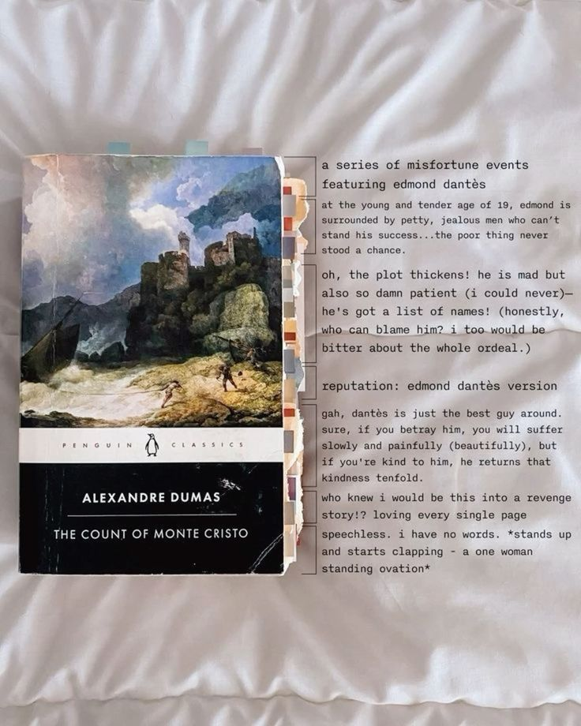

# divyanshi

```text
══════════════════════════════════════════════════════════

i build things because i get curious about them.

usually the curiosity starts with a question that should
probably have a simple answer.

it rarely does.

currently trying to understand why AI agents forget things,
why they hallucinate confidently, and how you debug something
that is probabilistic by design.

══════════════════════════════════════════════════════════
```

### now
```text
building       → cortex
breaking       → forge
thinking about → agent evaluation
learning       → C++ / systems
reading        → the count of monte cristo, the c++ programming language (4th edition) 
watching       → true detective
listening      → anything atp
```
---
### things i've made

```text
cortex
└─ context infrastructure for AI systems

helios
└─ trying to make agent behaviour observable

forge
└─ a local coding agent that i'm currently teaching
   not to confidently break things

meshchain
└─ what happens when the internet disappears?

resqnet
└─ emergency coordination

kanwar sahayata
└─ building for people who can't be assumed to have
   perfect connectivity

civicpulse
└─ civic issues, but with better infrastructure around them
```

some are projects.
some are experiments.
i'm still figuring out which is which.

---

### things i keep coming back to
```text
>why is "the agent said it worked" treated as evidence?

>what does memory actually mean for an AI system?

>how much infrastructure does an agent need before
the model becomes the easy part?

>what happens to software when the network isn't there?

>why do we keep making systems more autonomous before
we've figured out how to understand what they're doing?

>am i solving an actual problem or just building
infrastructure because infrastructure is fun?
```

---
### consumed lately
**watching**

`nana`


me and my two personalities

**reading**

`the count of monte cristo`



> “All human wisdom is contained in these two words - Wait and Hope”

currently on → `chapter 53`

**listening**

`pyar n stuff by nanku`

currently stuck on → `pyar ki si`

---

### things i'm learning

```text
C++, Rust, distributed systems, AI infrastructure, agent evaluation, systems design
```

---

### stack

```text
languages
─────────
Python, Java, C++, C, TypeScript, JavaScript
Rust → learning

AI / systems
────────────
LLMs, AI Agents, RAG, MCP, NLP, Agent Evaluation, Orchestration, Context Systems, Tracing

backend
───────
Node.js, Express, PostgreSQL, MySQL, MongoDB, Redis, Prisma, Docker

frontend
────────
React, Next.js, Tailwind CSS

cloud / data
────────────
Oracle Cloud, Snowflake, Vercel
```

not because i have mastered all of this.

mostly because these are the tools i've ended up reaching
for while trying to answer questions.

---

### random thought

> we keep making AI agents more autonomous before we've
> figured out how to understand why they did something.

---

```text
$ git log --oneline

build something
break something
question assumptions
build again
figure out why
repeat
```

---

```text
$ ./run curiosity

> no results found.

> try building it yourself.
```

---

### find me

[GitHub](https://github.com/divsvash) · [LinkedIn](https://www.linkedin.com/in/divyanshi-vashistha-4a026627/) · [Email](mailto:divyanshivashistha@gmail.com)  · [Kaggle](https://www.kaggle.com/d1vyanshii) · [HuggingFace](https://huggingface.co/divsvash)


<sub>last updated when the next obsession ships.</sub>
